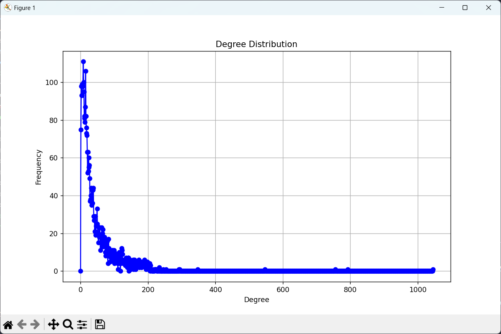
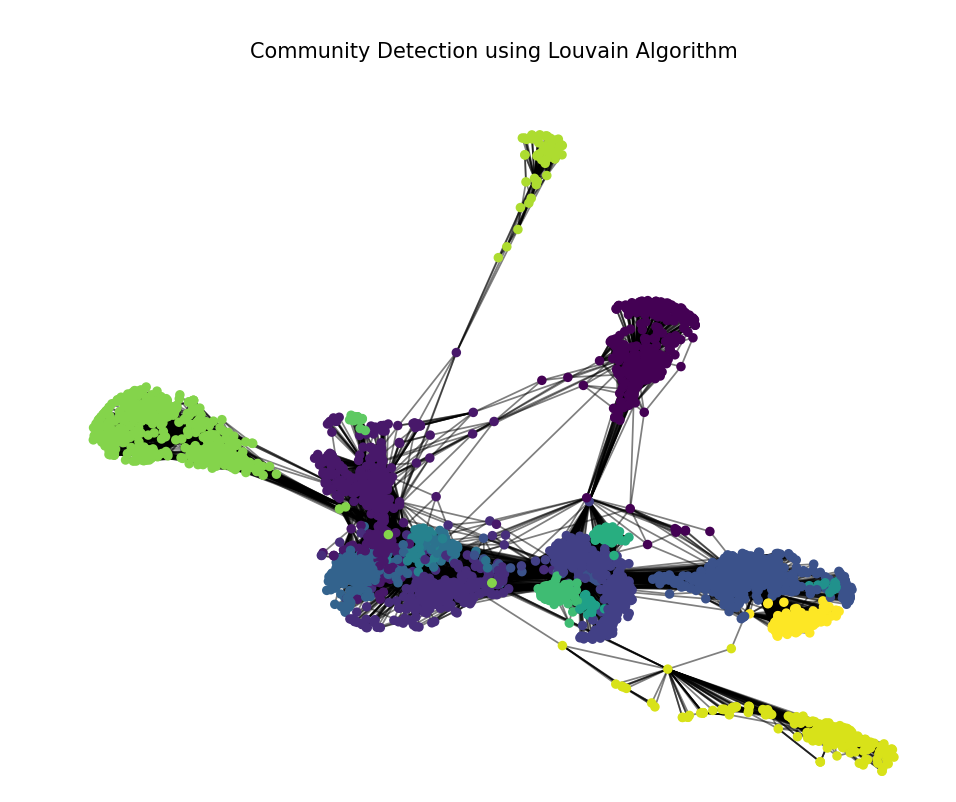

Name: Nguyen Quang Anh - Student ID: BA10-002
# Objective
The goal of this mini-project is to develop your skills on complex network (graphs) analysis. I will choose a dataset from Stanford Large Network Dataset Collection, dataset is [Social circles: Facebook](https://snap.stanford.edu/data/ego-Facebook.html) and develop an exploratory analysis to understand and discuss some important properties of the graph.

# Keys points
You are free to focus your analysis on the factors you consider relevant for the network dataset you will have chosen.

You will at least study the following points:

## 1. Basic connectivity analysis:
- Data description: origin of the data, and for each graph, number of nodes and edges

| Dataset statistics               | Number        |
|----------------------------------|---------------|
| Nodes                            | 4039          |
| Edges                            | 88234         |
| Nodes in largest WCC             | 4039 (1.000)  |
| Edges in largest WCC             | 88234 (1.000) |
| Nodes in largest SCC             | 4039 (1.000)  |
| Edges in largest SCC             | 88234 (1.000) |
| Average clustering coefficient   | 0.6055        |
| Number of triangles              | 1612010       |
| Fraction of closed triangles     | 0.2647        |
| Diameter (longest shortest path) | 8             |
| 90-percentile effective diameter | 4.7           |
- Is the graph is connected? The graph is connected
- Compute, plot and comment the distribution of nodes' degrees
- Number of nodes: 4039
- Number of edges: 88234
- Top 5 nodes by betweenness centrality:
  - Node 107: 0.4805180785560152
  - Node 1684: 0.3377974497301992
  - Node 3437: 0.23611535735892905
  - Node 1912: 0.2292953395868782
  - Node 1085: 0.14901509211665306
- Are the (these) graph(s) scale free? Yes, because we can visually inspect the degree distribution plot and/or perform statistical tests for power-law distribution
- According to various **centrality measures** (betweenness, etc), which are the most important?
  - Betweenness centrality: 107, 1684, 3437, 1912, 1085
Here is the code about degree distribution:

```python
import networkx as nx
import matplotlib.pyplot as plt
from collections import Counter
import community.community_louvain  # Louvain algorithm

# Load Facebook social circles dataset
# Replace 'path_to_file' with the actual path to the dataset file
path_to_file = "Session9/facebook_combined.txt"
G = nx.read_edgelist(path_to_file)

# 1. Basic connectivity analysis
# Data description
print("Number of nodes:", G.number_of_nodes())
print("Number of edges:", G.number_of_edges())

# Is the graph connected (or how many connected components)?
if nx.is_connected(G):
    print("The graph is connected.")
else:
    print("Number of connected components:", nx.number_connected_components(G))

# Compute, plot and comment the distribution of nodes' degrees
degrees = [deg for node, deg in G.degree()]
degree_counts = Counter(degrees)
degree_hist = [degree_counts[deg] for deg in range(max(degrees) + 1)]

plt.figure(figsize=(10, 6))
plt.plot(degree_hist, 'b-', marker='o')
plt.title("Degree Distribution")
plt.xlabel("Degree")
plt.ylabel("Frequency")
plt.grid(True)
plt.show()

# Are the graph(s) scale-free?
# A network is considered scale-free if its degree distribution follows a power-law distribution
# We can visually inspect the degree distribution plot and/or perform statistical tests for power-law distribution

# According to various centrality measures (betweenness, etc), which are the most important nodes?
# We'll compute and print the top 5 nodes based on betweenness centrality
betweenness_centrality = nx.betweenness_centrality(G)
sorted_betweenness = sorted(betweenness_centrality.items(), key=lambda x: x[1], reverse=True)[:5]
print("\nTop 5 nodes by betweenness centrality:")
for node, centrality in sorted_betweenness:
    print(f"Node {node}: {centrality}")
```


## 2. Find the communities
- Use the Louvain algorithm to find the communities and visualize the results.
- Describe quantitatively and qualitatively the communities.

**Note**: if the graph is large, communities can be used to produce a large scale plot (like the example we saw in the course)

I will use `networkx` python package, then I will use `community.community_louvain` package. Type: `pip install python-louvain` and `pip install community`

See how to fix code at: https://www.programmersought.com/article/35095865636/

```python
# 2. Find the communities using Louvain algorithm
# The Louvain algorithm detects communities in large networks efficiently
# It returns a partition, which is a dictionary where keys are nodes and values are community IDs
partition = community.community_louvain.best_partition(G)

# Visualize the communities
pos = nx.spring_layout(G)  # positions for all nodes
plt.figure(figsize=(10, 8))
cmap = plt.cm._colormaps['viridis']
nx.draw_networkx_nodes(G, pos, node_size=20, cmap=cmap, node_color=list(partition.values()))
nx.draw_networkx_edges(G, pos, alpha=0.5)
plt.title("Community Detection using Louvain Algorithm")
plt.axis("off")
plt.show()

# Describe quantitatively and qualitatively the communities
# We can analyze the size, density, and inter-community connections of the detected communities
community_sizes = Counter(partition.values())
print("\nCommunity sizes:", community_sizes)
```


Output: Community sizes: Counter({9: 548, 4: 535, 1: 447, 3: 428, 2: 423, 0: 352, 5: 323, 11: 237, 8: 226, 15: 206, 6: 117, 10: 73, 13: 61, 12: 25, 14: 19, 7: 19})

**Note**: It was warning in this code:  `cmap = plt.cm.get_cmap('viridis', max(list(partition.values())) + 1)`
```txt
MatplotlibDeprecationWarning: The get_cmap function was deprecated in Matplotlib 3.7 and will be removed two minor releases later. Use ``matplotlib.colormaps[name]`` or ``matplotlib.colormaps.get_cmap(obj)`` instead.
  cmap = plt.cm.get_cmap('viridis', max(list(partition.values())) + 1)
```
So the code fixed is: `cmap = plt.cm._colormaps['viridis']`